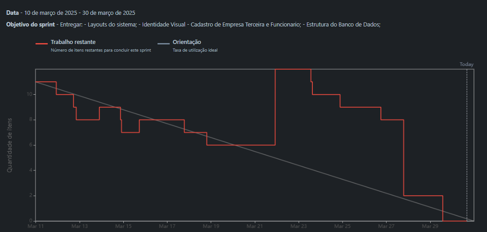
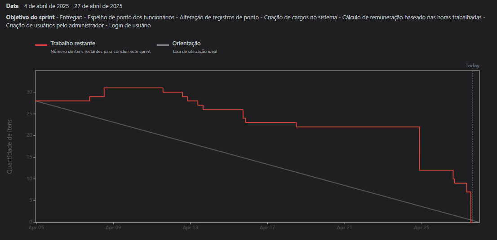
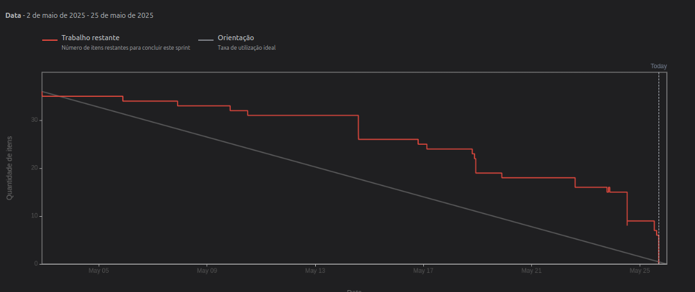
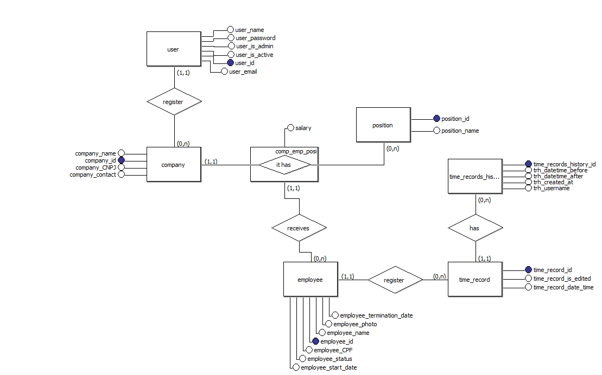

<!DOCTYPE html>
<html lang="pt-br">
<head>
    <meta charset="UTF-8">
    <meta name="viewport" content="width=device-width, initial-scale=1.0">
</head>
<body>

# Planejamento das Sprints

Sprint 1

## User Stories da Sprint

| Rank | Prioridade | ID | User Story | Estimativa | Sprint | Requisito do parceiro |
|------|------------|----|------------|------------|--------|-----------------------|
| 4 | ALTA | PS-4 | Como gestor de contratos quero adicionar empresas no sistema para vincular um funcionário.  | 37 | 1 | RF1, RNF1, RNF4  |

### Requisitos
- O sistema permite inserir nome, CNPJ e contato da empresa. 
- A empresa fica disponível para vinculação com funcionários.
- Empresas cadastradas podem ser editadas mas não removidas.

### Definition of ready: 
- User story claramente definido, incluindo critérios de aceitação.
- Tarefas definidas, atribuidas e relacionadas às User Stories
- A user story foi estimada e priorizada corretamente na sprint.

### Definition of done: 
- Código funcional e organizado, disponibilizado no GitHub.
- A funcionalidade foi revisada por pelo menos um membro da equipe (code review).
- Código aprovado após passar por todas as etapas de testes descritos na Documentação de Testes.
- A documentação do projeto foi atualizada.
- Nenhum bug crítico foi identificado nos testes.

## Regras de Negócio

| Defnições do Cliente                                                                                                |
|---------------------------------------------------------------------------------------------------------------------|
| A Altave ficará responsável pelo cadastro das empresas no sistema.                                                  |
| Somente a Altave terá acesso ao sistema.                                                                            |

---

| Rank | Prioridade | ID | User Story | Estimativa | Sprint | Requisito do parceiro |
|------|------------|----|------------|------------|--------|-----------------------|
| 5 | ALTA | PS-5 |Como gestor de contratos quero adicionar funcionários no sistema para ter controle dos seus horários de trabalho.   | 42 | 1 | RF1, RNF1, RNF4  |

### Requisitos
- O sistema permite inserir nome, CPF e foto do funcionário e vinculá-lo a uma empresa existente.
- O funcionário pode ser editado ou desligado (desativado) posteriormente.
- O sistema deve validar os dados obrigatórios e garantir que o CPF não esteja duplicado antes de concluir o cadastro.

### Definition of ready: 
- User story claramente definido, incluindo critérios de aceitação.
- Tarefas definidas, atribuidas e relacionadas às User Stories
- A user story foi estimada e priorizada corretamente na sprint.

### Definition of done: 
- Código funcional e organizado, disponibilizado no GitHub.
- A funcionalidade foi revisada por pelo menos um membro da equipe (code review).
- Código aprovado após passar por todas as etapas de testes descritos na Documentação de Testes.
- A documentação do projeto foi atualizada.
- Nenhum bug crítico foi identificado nos testes.

## Regras de Negócio

| Definições do Cliente                                                        |
|---------------------------------------------------------------------------------------------------------------------|
| Os funcionários não terão acesso ao sistema, somente o administrativo do contratante. |
| Não é necessário meios externos para inserir esses dados no sistema. |

---

### Burndown

### Video de demonstração Sprint 1
[🎥 Veja o vídeo de demonstração](https://youtu.be/PgfL2fV6vqs)

---

Sprint 2

## User Stories da Sprint

| Rank | Prioridade | ID | User Story | Estimativa | Sprint | Requisito do parceiro |
|------|------------|----|------------|------------|--------|-----------------------|
| 1 | ALTA | PS-1 | Como gestor de contratos quero visualizar as marcações que o colaborador fez para saber o total de horas trabalhadas | 22 | 2 | RF2, RNF1  |

### Requisitos
- O sistema exibe todas as marcações de ponto registradas pelos colaboradores.
- Permite filtrar marcações por período, empresa e funcionário.
- O tempo total trabalhado é calculado 

### Definition of ready: 
- User story claramente definido, incluindo critérios de aceitação.
- Tarefas definidas, atribuidas e relacionadas às User Stories
- A user story foi estimada e priorizada corretamente na sprint.

### Definition of done: 
- Código funcional e organizado, disponibilizado no GitHub.
- A funcionalidade foi revisada por pelo menos um membro da equipe (code review).
- Código aprovado após passar por todas as etapas de testes descritos na Documentação de Testes.
- A documentação do projeto foi atualizada.
- Nenhum bug crítico foi identificado nos testes.

## ## Regras de Negócio

| Definições do Cliente                                                                                               |
|---------------------------------------------------------------------------------------------------------------------|
| O ponto do funcionário pode ser inserido através de uma interface ou uma API.                                       |

---

| Rank | Prioridade | ID | User Story | Estimativa | Sprint | Requisito do parceiro |
|------|------------|----|------------|------------|--------|-----------------------|
| 3 | ALTA | PS-3 | Como gestor de contratos quero alterar um registro de ponto incorreto para manter a integridade das informações no sistema. | 21 | 2 | RF2, RNF1, RF4 |

### Requisitos
- O gestor pode editar um registro de ponto existente.
- As edições são registradas com um histórico de alterações.
- Apenas registros dentro de um período permitido podem ser alterados.

### Definition of ready: 
- User story claramente definido, incluindo critérios de aceitação.
- Tarefas definidas, atribuidas e relacionadas às User Stories
- A user story foi estimada e priorizada corretamente na sprint.

### Definition of done: 
- Código funcional e organizado, disponibilizado no GitHub.
- A funcionalidade foi revisada por pelo menos um membro da equipe (code review).
- Código aprovado após passar por todas as etapas de testes descritos na Documentação de Testes.
- A documentação do projeto foi atualizada.
- Nenhum bug crítico foi identificado nos testes.

## Regras de Negócio

| Definições do Cliente                                                                                               |
|---------------------------------------------------------------------------------------------------------------------|
| É possível editar um registro de ponto no sistema, mas não é necessário um alerta de registro inconsistente.       |

---

| Rank | Prioridade | ID | User Story | Estimativa | Sprint | Requisito do parceiro |
|------|------------|----|------------|------------|--------|-----------------------|
| 9 | MÉDIA | PS-9 | como gestor de contratos quero criar cargos de funcionarios no sistema para definir o pagamento por hora dos colaboradores.  | 18 | 2 | RF1, RNF1, RNF4  |

### Requisitos
- O sistema permite cadastrar cargos e definir valores por hora.
- Os cargos podem ser editados ou removidos.
-  Os cargos são vinculados corretamente aos funcionários.

### Definition of ready: 
- User story claramente definido, incluindo critérios de aceitação.
- Tarefas definidas, atribuidas e relacionadas às User Stories
- A user story foi estimada e priorizada corretamente na sprint.

### Definition of done: 
- Código funcional e organizado, disponibilizado no GitHub.
- A funcionalidade foi revisada por pelo menos um membro da equipe (code review).
- Código aprovado após passar por todas as etapas de testes descritos na Documentação de Testes.
- A documentação do projeto foi atualizada.
- Nenhum bug crítico foi identificado nos testes.

---

| Rank | Prioridade | ID | User Story | Estimativa | Sprint | Requisito do parceiro |
|------|------------|----|------------|------------|--------|-----------------------|
| 10 | BAIXA | PS-10 | Como gestor de contratos quero calcular quanto um funcionário receberá com base nas horas trabalhadas e cargo para garantir que as horas trabalhadas sejam devidamente pagas. | 20 | 2 | RF3, RF4, RNF1 |

### Requisitos
- O sistema calcula o valor devido ao funcionário com base no cargo e nas horas registradas.
- O cálculo considera apenas registros válidos.
- O gestor pode visualizar os valores totais por funcionário.

### Definition of ready: 
- User story claramente definido, incluindo critérios de aceitação.
- Tarefas definidas, atribuidas e relacionadas às User Stories
- A user story foi estimada e priorizada corretamente na sprint.

### Definition of done: 
- Código funcional e organizado, disponibilizado no GitHub.
- A funcionalidade foi revisada por pelo menos um membro da equipe (code review).
- Código aprovado após passar por todas as etapas de testes descritos na Documentação de Testes.
- A documentação do projeto foi atualizada.
- Nenhum bug crítico foi identificado nos testes.

## Regras de Negócio

| Definições do Cliente                                                        |
|---------------------------------------------------------------------------------------------------------------------|
| É uma ótima idéia colocar o cálculo de pagamento dos funcionrios no sistema e no relatório exportado. |
| O pagamento do funcionário pode ser definido por hora trabalhada. |

---

| Rank | Prioridade | ID | User Story | Estimativa | Sprint | Requisito do parceiro |
|------|------------|----|------------|------------|--------|-----------------------|
| 11 | ALTA| PS-22 | Como gestor de contratos quero realizar o acesso no sistema através de email e senha para garantir a segurança dos dados contidos no mesmo | 37 | 2 | RF1, RNF1 |

### Requisitos
- O sistema valida as credenciais de acesso do usuario
- O usuario só é capaz de acessar o sistema com as credenciais corretas
- O usuario só acessa o sistema com credenciais de domínio da empresa

### Definition of ready: 
- User story claramente definido, incluindo critérios de aceitação.
- Tarefas definidas, atribuidas e relacionadas às User Stories
- A user story foi estimada e priorizada corretamente na sprint.

### Definition of done: 
- Código funcional e organizado, disponibilizado no GitHub.
- A funcionalidade foi revisada por pelo menos um membro da equipe (code review).
- Código aprovado após passar por todas as etapas de testes descritos na Documentação de Testes.
- A documentação do projeto foi atualizada.
- Nenhum bug crítico foi identificado nos testes.

## Regras de Negócio

| Definições do Cliente                                                        |
|-------------------------------------------------------------------------------------------------------------------|
| O departamento que irá utilizar o sistema é o de gestão de contratos. |

---

| Rank | Prioridade | ID | User Story | Estimativa | Sprint | Requisito do parceiro |
|------|------------|----|------------|------------|--------|-----------------------|
| 12 | MÉDIA | PS-30 | Como Administrador do Sistema quero poder cadastrar usuarios no sistema para ter controle do acesso dos funcionários gestores de contrato | 19 | 2 | RF1, RNF1 |

### Requisitos
- O sistema permite o administrador cadastrar novos usuarios
- Os cadastros de usuarios no sistema devem conter email e senha provisória
-  O usuario pode alterar a senha provisória no primeiro acesso

### Definition of ready: 
- User story claramente definido, incluindo critérios de aceitação.
- Tarefas definidas, atribuidas e relacionadas às User Stories
- A user story foi estimada e priorizada corretamente na sprint.

### Definition of done: 
- Código funcional e organizado, disponibilizado no GitHub.
- A funcionalidade foi revisada por pelo menos um membro da equipe (code review).
- Código aprovado após passar por todas as etapas de testes descritos na Documentação de Testes.
- A documentação do projeto foi atualizada.
- Nenhum bug crítico foi identificado nos testes.

## Regras de Negócio

| Definições do Cliente                                                                                              |
|--------------------------------------------------------------------------------------------------------------------|
| Cada usuário do sistema terá seu próprio login com dominio da Altave.|
| O administrador pode criar esses usuários no sistema.  |

---

### Burndown

### Video de demonstração Sprint 2
[🎥 Veja o vídeo de demonstração](https://youtu.be/U-m7gCkJw-I)

    
Sprint 3

## User Stories da Sprint

| Rank | Prioridade | ID | User Story | Estimativa | Sprint | Requisito do parceiro |
|------|------------|----|------------|------------|--------|-----------------------|
| 2 | ALTA | PS-2 | Como gestor de contratos quero visualizar quantos funcionários trabalharam em determinado pedíodo para ter controle do número de profissionais no local de trabalho.| 35 | 3 | RF2, RFN1 |

### Requisitos
- O histórico deve ser acessível através de uma interface simples e clara. 
- O histórico deve mostrar a lista de alterações feitas no ponto, com o nome do usuário que fez a alteração e a data e hora de cada alteração.
- O sistema deve registrar cada alteração no ponto incluindo o ID do funcionário, a data e a hora da alteração.

### Definition of ready: 
- User story claramente definido, incluindo critérios de aceitação.
- Tarefas definidas, atribuidas e relacionadas às User Stories
- A user story foi estimada e priorizada corretamente na sprint.

### Definition of done: 
- Código funcional e organizado, disponibilizado no GitHub.
- A funcionalidade foi revisada por pelo menos um membro da equipe (code review).
- Código aprovado após passar por todas as etapas de testes descritos na Documentação de Testes.
- A documentação do projeto foi atualizada.
- Nenhum bug crítico foi identificado nos testes.

---

| Rank | Prioridade | ID | User Story | Estimativa | Sprint | Requisito do parceiro |
|------|------------|----|------------|------------|--------|-----------------------|
| 6 | ALTA | PS-6 | Como gestor de contratos quero visualizar as informações de empresas e funcionários através de um dashboard para consultar as informações de forma gráfica. | 29 | 3 | RF2, RF4, RNF1  |

### Requisitos
- O dashboard exibe gráficos interativos sobre empresas, funcionários e marcações de ponto.
- Permite filtragem por empresa, funcionário e período.
- Os dados são atualizados em tempo real conforme novas entradas são registradas.

### Definition of ready: 
- User story claramente definido, incluindo critérios de aceitação.
- Tarefas definidas, atribuidas e relacionadas às User Stories
- A user story foi estimada e priorizada corretamente na sprint.

### Definition of done: 
- Código funcional e organizado, disponibilizado no GitHub.
- A funcionalidade foi revisada por pelo menos um membro da equipe (code review).
- Código aprovado após passar por todas as etapas de testes descritos na Documentação de Testes.
- A documentação do projeto foi atualizada.
- Nenhum bug crítico foi identificado nos testes.

## Regras de Negócio

| Definições do Cliente                                                                                              |
|--------------------------------------------------------------------------------------------------------------------|
| É importante que seja exibido no dashboard quantas horas cada empresa gastou em determinado período |

---

| Rank | Prioridade | ID | User Story | Estimativa | Sprint | Requisito do parceiro |
|------|------------|----|------------|------------|--------|-----------------------|
| 7 | ALTA | PS-7 | Como gestor de contratos quero extrair relatórios das informações do sistema para realizar uma análise detalhada de uma manutenção. | 27 | 3 | RF2, RF3, RNF1 |

### Requisitos
- O sistema gera relatórios detalhados com base nos filtros aplicados.
- Os relatórios podem ser exportados em formatos comuns (Excel).
- Os relatórios incluem todas as informações necessárias para análise.

### Definition of ready: 
- User story claramente definido, incluindo critérios de aceitação.
- Tarefas definidas, atribuidas e relacionadas às User Stories
- A user story foi estimada e priorizada corretamente na sprint.

### Definition of done: 
- Código funcional e organizado, disponibilizado no GitHub.
- A funcionalidade foi revisada por pelo menos um membro da equipe (code review).
- Código aprovado após passar por todas as etapas de testes descritos na Documentação de Testes.
- A documentação do projeto foi atualizada.
- Nenhum bug crítico foi identificado nos testes.

---

| Rank | Prioridade | ID | User Story | Estimativa | Sprint | Requisito do parceiro |
|------|------------|----|------------|------------|--------|-----------------------|
| 8 | MÉDIA | PS-8 | Como gestor de contratos quero filtrar tanto a consulta de informações como os relatórios por empresa, funcionário e período para obter informações mais específicas. | 27 | 3 | RF2, RF3, RF4, RNF1  |

### Requisitos
- Permite aplicar filtros por empresa, funcionário e período.
- Os filtros são aplicados instantaneamente, refletindo nos dados exibidos.
- As exportações respeitam os filtros aplicados.

### Definition of ready: 
- User story claramente definido, incluindo critérios de aceitação.
- Tarefas definidas, atribuidas e relacionadas às User Stories
- A user story foi estimada e priorizada corretamente na sprint.

### Definition of done: 
- Código funcional e organizado, disponibilizado no GitHub.
- A funcionalidade foi revisada por pelo menos um membro da equipe (code review).
- Código aprovado após passar por todas as etapas de testes descritos na Documentação de Testes.
- A documentação do projeto foi atualizada.
- Nenhum bug crítico foi identificado nos testes.

---

| Rank | Prioridade | ID | User Story | Estimativa | Sprint | Requisito do parceiro |
|------|------------|----|------------|------------|--------|-----------------------|
| 13 | ALTA | PS-63 | Como gestor de contrato quero visualizar um histórico de pontos alterados para saber quem alterou e quando o ponto foi alterado | 26 | 3 | RNF1 |

### Requisitos
- Permite aplicar filtros por empresa, funcionário e período.
- Os filtros são aplicados instantaneamente, refletindo nos dados exibidos.
- As exportações respeitam os filtros aplicados.

### Definition of ready: 
- User story claramente definido, incluindo critérios de aceitação.
- Tarefas definidas, atribuidas e relacionadas às User Stories
- A user story foi estimada e priorizada corretamente na sprint.

### Definition of done: 
- Código funcional e organizado, disponibilizado no GitHub.
- A funcionalidade foi revisada por pelo menos um membro da equipe (code review).
- Código aprovado após passar por todas as etapas de testes descritos na Documentação de Testes.
- A documentação do projeto foi atualizada.
- Nenhum bug crítico foi identificado nos testes.

## Regras de Negócio

| Definições do Cliente                                                                                               |
|---------------------------------------------------------------------------------------------------------------------|
| É importante que o sistema possua um histórico de registros de pontos alterados no sistema. |

---

### Burndown

### Video de demonstração Sprint 3
[🎥 Veja o vídeo de demonstração](https://youtu.be/yODOR4y8xXY).

---

## Diagrama Entidade e Relacionamento do Banco de Dados

    

</body>
</html>
