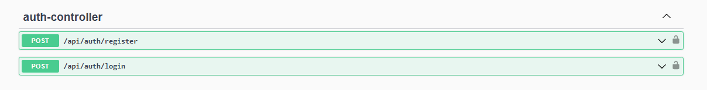
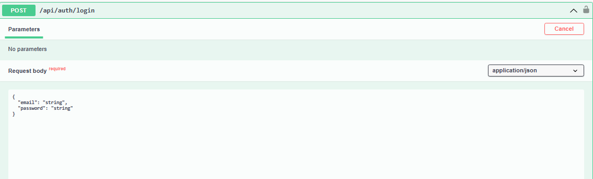
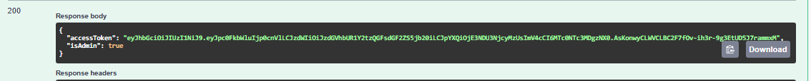
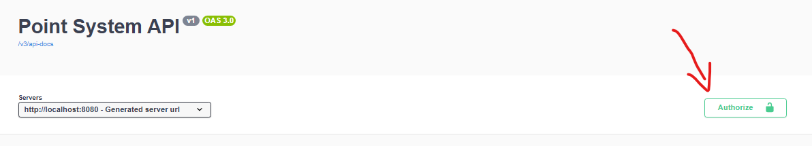

# 📘 Acessando a Documentação da API (Swagger)

A nossa aplicação conta com uma documentação interativa das APIs gerada automaticamente pelo **Swagger**. Siga os passos abaixo para acessá-la:

---

## ✅ Passo 1: Certifique-se de que a aplicação está rodando

Antes de acessar a documentação, verifique se a aplicação Spring Boot está em execução. Você pode iniciar a aplicação de diferentes formas:

### Pelo terminal:

```bash
./mvnw spring-boot:run
```

### Pelo IDE (IntelliJ / Eclipse):

Execute a classe principal com a anotação `@SpringBootApplication` (geralmente `Application.java`).

---

## 🌐 Passo 2: Acesse a URL da documentação

Abra o navegador e vá até o seguinte endereço:

```
http://localhost:8080/swagger-ui.html
```

> ℹ️ Caso você tenha configurado uma porta diferente, substitua `8080` pela porta correspondente.

---

## 🔒 Passo 3: Faça a autenticação para acessar os endpoints

Após acessar o swagger procure por `auth-controller` e acesse o `api/auth/login`

<div align="center">

</div>

Ao acessar o endpoint de login, insira as credenciais de acesso no json

<div align="center">

</div>

Em seguida copie o token que retorna na requisição (esse em verde)

<div align="center">

</div>

Com o token copiado abra o `authorize` 

<div align="center">

</div>

Por fim cole o token e confirme a autenticação

<div align="center">

</div>

✅ Pronto, o acesso aos endpoits ja está liberado!

---

## 🛠️ O que você encontra na documentação?

- Lista de todos os endpoints REST disponíveis
- Descrição das rotas, parâmetros e retornos
- Possibilidade de testar os endpoints diretamente pelo navegador
- Modelos das entidades utilizadas nas requisições e respostas
